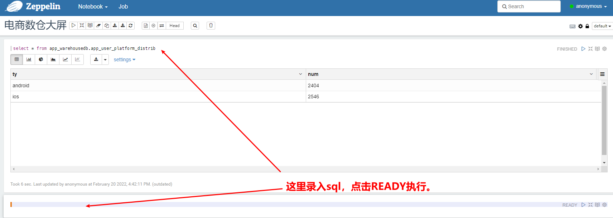

# 一、综合项目：数据仓库

## 1.1、分析

### 1.1.1、数据仓库分层设计

- APP（又称ADS：Application Data Service）数据应用层：为统计报表提供数据
- DWS（Data Warehouse Service）数据汇总层：对数据进行轻度汇总（宽表）
- DWD（Data Warehouse Details）明细数据层：清洗之后的数据
- ODS（Operation Data Store）原始数据层：存放原始数据

### 1.1.2、典型的数据仓库系统架构


### 1.1.3、项目需求分析

想要开发一个完整的数据仓库系统，至少需要以下这几个功能模块：

- 数据采集平台，这个模块主要负责采集各种数据源的数据
- 数据仓库，这个模块负责数据仓库和管理
- 数据报表，这个模块其实就是数据可视化展示了

通过这三个模块可以实现数据采集，构建数据仓库，最后基于数据仓库中的数据实现上层应用，体现数据仓库的价值。

### 1.1.4、数据选项

- 数据采集：Flume【推荐】、Logstash、FileBeat、Sqoop【推荐】
  - Flume：日志采集
  - Sqoop：关系型数据库采集
- 数据存储：HDFS【推荐】、MySQL
- 数据计算：Hive【优先】、Spark
- 数据可视化：Hue、Zeppelin【推荐】、Echarts（开发数据接口）

### 1.1.5、整体架构设计


### 1.1.6、服务器资源规划-测试环境


### 1.1.7、服务器资源规划-生产环境


# 二、电商数据仓库之用户行为数仓

## 2.1、数据准备


### 2.1.1、创建数据库和表

- 创建数据库

```mysql
-- 创建用户
CREATE USER 'flyin'@'%' identified BY 'Flyin@123';
-- 授权用户
GRANT ALL PRIVILEGES ON *.* TO 'flyin'@'%' WITH GRANT OPTION;
-- 创建数据库
CREATE DATABASE IF NOT EXISTS warehousedb DEFAULT CHARACTER SET utf8mb4 COLLATE utf8mb4_unicode_ci;
-- 使用数据库
use warehousedb;
```

- 创建表

```bash
mysql -uflyin -pFlyin@123 warehousedb < /home/emon/bigdata/warehouse/data/init_mysql_tables.sql
```

### 2.1.2、初始化数据

- 初始化UserAction数据

执行类：`com.coding.bigdata.useraction.GenerateUserActionData`

- 初始化GoodsOrder数据

执行类：`com.coding.bigdata.useraction.GenerateGoodsOrderData`

### 2.1.3、数据采集

#### 2.1.3.1、用户订单数据表详情

- 对小表，全量采集
- 对大表，增量采集（按照变更时间）

| 表名          | 导入方式 | 表名           | 导入方式 |
| ------------- | -------- | -------------- | -------- |
| user          | 全量     | user_order     | 增量     |
| user_extend   | 全量     | order_item     | 增量     |
| user_addr     | 全量     | order_delivery | 增量     |
| goods_info    | 全量     | payment_flow   | 增量     |
| category_code | 全量     |                |          |

#### 2.1.3.2、数据采集之UserAction数据

- 启动flume脚本

```bash
# 先执行该脚本命令，再执行`com.coding.bigdata.useraction.GenerateUserActionData`类产生日志
flume-ng agent --conf /usr/local/flume/conf \
--conf-file /home/emon/bigdata/warehouse/shell/flume/execMemoryHdfs/exec-memory-hdfs.conf \
--name a1 \
-Dflume.root.logger=INFO,console
```

#### 2.1.3.3、数据采集之GoodsOrder数据

- 执行全量采集脚本

```bash
sh /home/emon/bigdata/warehouse/shell/sqoop/collect_data_full.sh 20260101
```

- 执行增量采集脚本

```bash
sh /home/emon/bigdata/warehouse/shell/sqoop/collect_data_incr.sh 20260101
```

## 2.2、创建ODS层

- 表介绍

| 表名            | 解释                  |
| --------------- | --------------------- |
| ods_user_active | 用户主动活跃表(act=1) |
| ods_click_good  | 点击商品表(act=2)     |
| ods_good_item   | 商品详情页表(act=3)   |
| ods_good_list   | 商品列表页表(act=4)   |
| ods_app_close   | APP崩溃数据表（act=5  |

- 创建hive库、hive外部表并设置分区

```bash
# 初始化ods库与表
[emon@emon ~]$ sh /home/emon/bigdata/warehouse/shell/userAction/ods_init_table.sh 
# 添加分区
[emon@emon ~]$ sh /home/emon/bigdata/warehouse/shell/userAction/ods_add_partition.sh 20260101
```

## 2.3、创建DWD层

- 表介绍

| 表名            | 解释                  |
| --------------- | --------------------- |
| dwd_user_active | 用户主动活跃表(act=1) |
| dwd_click_good  | 点击商品表(act=2)     |
| dwd_good_item   | 商品详情页表(act=3)   |
| dwd_good_list   | 商品列表页表(act=4)   |
| dwd_app_close   | APP崩溃数据表（act=5  |

- 创建hive库、hive外部表并设置分区

```bash
# 初始化ods库与表
[emon@emon ~]$ sh /home/emon/bigdata/warehouse/shell/userAction/dwd_init_table.sh
# 添加分区
[emon@emon ~]$ sh /home/emon/bigdata/warehouse/shell/userAction/dwd_add_partition.sh 20260101
```

## 2.4、需求分析与模拟数据初始化

### 2.4.1、需求列表

- 需求1：每日新增用户相关指标
- 需求2：每日活跃用户（主活）相关指标
- 需求3：用户7日流失push提醒相关指标
- 需求4：每日启动App次数相关指标
- 需求5：操作系统活跃用户相关指标
- 需求6：APP崩溃相关指标

### 2.4.2、模拟20260201-20260228数据

- 初始化UserAction数据

执行类：`com.coding.bigdata.useraction.GenerateUserActionData2`

### 2.4.3·添加分区

```bash
# 添加ods分区：20260201-20260228
[emon@emon ~]$ sh /home/emon/bigdata/warehouse/shell/userAction/tmp_load_ods_data.sh
# 添加dwd分区：20260201-20260228
[emon@emon ~]$ sh /home/emon/bigdata/warehouse/shell/userAction/tmp_load_dwd_data.sh
```

## 2.5、需求1：每日新增用户相关指标

新增用户：也指新增设备，指第一次安装并且使用app的用户，后期卸载之后再使用就不是新用户了。

### 2.5.1、指标1：每日新增用户量

- ods层表名：ods_user_active
- dwd层表名：dwd_user_active

第一步：我们基于清洗之后打开app上报的数据创建一个历史表，这个表里面包含的有xaid字段，针对每天的数据基于axid进行去重。

第二步：如果我们要计算2026年2月1日的新增用户量，就拿这一天上报的打开app的数据，和前面的历史表进行left join，使用xaid进行关联，关联不上的数据则为新增数据。

> 举个例子：第一步会产生一个历史表，`dws_user_active_history`，这个表中有一个xaid字段
>
> dws_user_active_history
>
> xaid
>
> a1
>
> b1
>
> c1
>
> d1
>
> 第二步会产生一个临时表，表里面包含的是那一天上报的打开app的数据
>
> dws_user_active_20260201_tmp
>
> xaid
>
> a1
>
> b1
>
> x1
>
> y1
>
> z1
>
> 对这两个表进行left join
>
> dws_user_active_20260201_tmp								dws_user_active_history
>
> xaid																					xaid
>
> a1																						a1
>
> b1																						b1
>
> x1																						null
>
> y1																						null
>
> z1																						null
>
> 此时：`dws_user_active_history.xaid`为null的数据记录数即为当日新增用户数

第三步：将计算出来的每日新增用户信息保存到表`dws_user_new_item`表中，这个表按照天作为分区，便于后期其他需求使用这个表。

第四步：基于`dws_user_new_item`对数据进行聚合，将计算出来的新增用户数量保存到结果表`app_user_new_count`表。

注意：在这里处理完之后，还需要将`dws_user_active_20260201_tmp`这个临时表数据insert到`dws_user_active_history`这个历史表中。

最后，删除这个临时表。

### 2.5.2、指标2：每日新增用户量的日环比和周同比

同比：一般是指本期统计数据和往年的同时期的统计数据比较。

环比：一般是指本期统计数据和上一期的统计数据作比较。


日环比=（本期的数据-上一期的数据）/上一期的数据，日环比中的单位是天。

周同比=（本期的数据-上一期的数据）/上一期的数据，周同比中的单位是周（7天）。


实现思路：

直接基于`app_user_new_count`进行统计即可，可以统计出来某一天的日环比和周同比，生成一个新表`app_user_new_count_ratio`。

里面包含日期、新增用户量、日环比、周同比。

### 2.5.3、汇总总结

我们最终要在DWS创建3个表：

- dws_user_active_20260201_tmp
- dws_user_active_history
- dws_user_new_item

在APP层要创建2个表：

- app_user_new_count
- app_user_new_count_ratio

### 2.5.4、脚本执行之DWS层

针对dws层抽取脚本：

1：表初始化脚本（初始化执行一次）

```bash
# 初始化ods库与表
[emon@emon ~]$ sh /home/emon/bigdata/warehouse/shell/userAction/dws_init_table_1.sh
```

2：添加分区数据脚本（每天执行一次）

```bash
# 添加分区：20260201-20260209
[emon@emon ~]$ sh /home/emon/bigdata/warehouse/shell/userAction/tmp_load_dws_data_1.sh
```

### 2.5.5、脚本执行之APP层

针对dws层抽取脚本：

1：表初始化脚本（初始化执行一次）

```bash
# 初始化ods库与表
[emon@emon ~]$ sh /home/emon/bigdata/warehouse/shell/userAction/app_init_table_1.sh
```

2：添加分区数据脚本（每天执行一次）

```bash
# 添加分区：20260201-20260209
[emon@emon ~]$ sh /home/emon/bigdata/warehouse/shell/userAction/tmp_load_app_data_1.sh
```

## 2.6、需求2：每日活跃用户（主活）相关指标

### 2.6.1、指标1：每日主活用户量

直接使用dws层的`dws_user_active_history`这个表，直接求和即可获取到当日的主活用户量，将最终的结果保存到app层的`app_user_active_count`表中。

### 2.6.2、指标2：每日主活用户量的日环比和周同比

这个指标直接基于每日主活用户量的表`app_user_active_count`进行计算即可，把最终的结果保存到app层的`app_user_active_count_ratio`表中。

### 2.6.3、脚本执行之APP层

1：表初始化脚本（初始化执行一次）

```bash
# 初始化ods库与表
[emon@emon ~]$ sh /home/emon/bigdata/warehouse/shell/userAction/app_init_table_2.sh
```

2：添加分区数据脚本（每天执行一次）

```bash
# 添加分区：20260201-20260209
[emon@emon ~]$ sh /home/emon/bigdata/warehouse/shell/userAction/tmp_load_app_data_2.sh
```

### 2.6.4、扩展需求：如何统计每周每月的主活用户量

每周：按照自然周，每周一凌晨计算上一周的主活。

每月：按照自然月，每月1号计算上一个月的主活。


## 2.7、需求3：用户7日流失push提醒相关指标

如果2.2日首次进入，一直到2.9日都没再登录，算7日流失。

### 2.7.1、指标1：用户7日流失push

第一步：基于 *dws_user_active_history* 表，获取表中最近8天（登陆日+后续7日）的数据，根据xaid进行分组，这样可以获取xaid以及xaid对应的多个日期(dt)。

第二步：接着需要对xaid对应的dt进行过滤，获取xaid中最大的dt，判断这个dt是否等于（当天日期-7），如果满足条件，则说明这个用户最近7日内没有使用app，就认为他属于7日流失用户。

> 举个例子：dws_user_active_history表中有以下几条数据
>
> xaid					dt
>
> a1						2026-02-01
>
> a1						2026-02-05
>
> b1						2026-02-01
>
> b1						2026-02-02
>
> c1						2026-02-03
>
>  
>
> 针对这份数据，我们想要在02-09号统计用户7日流失量
>
> 那也就意味着要统计里面在02-02号使用过APP，但是在之后的7天内，一直到02-09号都没有再使用过app的用户。
>
>  
>
> 根据xaid进行分组，获取里面最大的日期（最近一次使用app的时间）
>
> a1					2026-02-01,2026-02-05
>
> b1					2026-02-01,2026-02-02
>
> c1					2026-02-03
>
> 
>
> 判断这个时间是否等于02-02，如果满足这个条件，就说在02-09号之前的7天内没有使用过app。
>
> 这里的b1满足条件，所以它就是7日流失用户了。

第三步：将满足条件的xaid数据保存到dws层的 *dws_user_lost_item* 表中。

第四步：对 *dws_user_lost_item* 表中的数据进行聚合统计，统计用户7日流失数据量，保存到APP层的 *app_user_lost_count* 表中。

### 2.7.2、脚本执行之DWS层

1：表初始化脚本（初始化执行一次）

```bash
# 初始化ods库与表
[emon@emon ~]$ sh /home/emon/bigdata/warehouse/shell/userAction/dws_init_table_3.sh
```

2：添加分区数据脚本（每天执行一次）

```bash
# 添加分区：20260201-20260209
[emon@emon ~]$ sh /home/emon/bigdata/warehouse/shell/userAction/tmp_load_dws_data_3.sh
```

### 2.7.3、脚本执行之APP层

1：表初始化脚本（初始化执行一次）

```bash
# 初始化ods库与表
[emon@emon ~]$ sh /home/emon/bigdata/warehouse/shell/userAction/app_init_table_3.sh
```

2：添加分区数据脚本（每天执行一次）

```bash
# 添加分区：20260201-20260209
[emon@emon ~]$ sh /home/emon/bigdata/warehouse/shell/userAction/tmp_load_app_data_3.sh
```

## 2.8、需求4：每日启动App次数相关指标

### 2.8.1、指标1：每日人均启动APP次数

每日人均启动APP次数=当日所有用户启动APP总次数/当日所有人数

实现思路：

第一步：基于 *dws_user_active_history* 表，统计当日的数据，根据times字段的值求pv和uv即可。

第二步：将计算的结果到APP层的 *app_user_open_app_count* 表。

### 2.8.2、指标2：每日APP启动次数分布（1次2次3次及以上）

实现思路：

对 *dws_user_active_history* 里面的times字段进行统计，计算times=1的数据条数、times=2的数据条数以及times>=3的数据条数即可，将最终的结果保存到APP层的 *app_user_open_app_distrib*。

### 2.8.3、脚本执行之APP层

1：表初始化脚本（初始化执行一次）

```bash
# 初始化ods库与表
[emon@emon ~]$ sh /home/emon/bigdata/warehouse/shell/userAction/app_init_table_4.sh
```

2：添加分区数据脚本（每天执行一次）

```bash
# 添加分区：20260201-20260209
[emon@emon ~]$ sh /home/emon/bigdata/warehouse/shell/userAction/tmp_load_app_data_4.sh
```

## 2.9、需求5：操作系统活跃用户相关指标

### 2.9.1、指标1：操作系统活跃用户分布（安卓、IOS）

### 2.9.2、指标2：安卓系统版本活跃用户分布

### 2.9.3、指标3：IOS系统版本活跃用户分布

### 2.9.4、指标4：设备品牌活跃用户分布

### 2.9.5、指标5：设备型号活跃用户分布

### 2.9.6、指标6：网络类型活跃用户分布

针对以上6大指标，其实主要就是针对 *dwd_user_active* 表中的这些相关维度字段进行分组聚合统计。

实现思路：

第一步：利用咱们前面讲的维度建模的思想，使用星型模型，基于 *dwd_user_active* 表，在外层构建对应的维度表。

第二步：在DWS层基于以上6种维度创建对应的维度聚合表，按天创建分区。

对应的表名为：

> *dws_user_platform_distrib*
>
> *dws_user_android_osver_distrib*
>
> *dws_user_ios_osver_distrib*
>
> *dws_user_brand_distrib*
>
> *dws_user_model_distrib*
>
> *dws_user_net_distrib*

第三步：基于DWS层的轻度聚合数据进行全局聚合，因为这些指标统计的时候需要统计所有数据，只统计某一天的没有多大意义，将最终聚合的结果保存到APP层，这里面的表就是普通的外部表了，里面也不需要日期字段，每天重新生成表里面的数据即可。

注意了：咱们前面保存的有每天聚合的数据，如果后期有需求要统计一段时间内的这些维度的指标，那也很简单，直接基于DWS层的表进行统计即可，从这也提现出来了数据分层的好处。

在APP层对应的表名为：

> *app_user_platform_distrib*
>
> *app_user_android_osver_distrib*
>
> *app_user_ios_osver_distrib*
>
> *app_user_brand_distrib*
>
> *app_user_model_distrib*
>
> *app_user_net_distrib*

### 2.9.7、脚本执行之DWS层

1：表初始化脚本（初始化执行一次）

```bash
# 初始化ods库与表
[emon@emon ~]$ sh /home/emon/bigdata/warehouse/shell/userAction/dws_init_table_5.sh
```

2：添加分区数据脚本（每天执行一次）

```bash
# 添加分区：20260201-20260209
[emon@emon ~]$ sh /home/emon/bigdata/warehouse/shell/userAction/tmp_load_dws_data_5.sh
```

### 2.9.7、脚本执行之APP层

1：表初始化脚本（初始化执行一次）

```bash
# 初始化ods库与表
[emon@emon ~]$ sh /home/emon/bigdata/warehouse/shell/userAction/app_init_table_5.sh
```

2：添加分区数据脚本（每天执行一次）

```bash
# 重新统计全量数据
[emon@emon ~]$ sh /home/emon/bigdata/warehouse/shell/userAction/app_add_partition_5.sh
```

## 2.10、需求6：APP崩溃相关指标

### 2.10.1、指标1：每日操作系统崩溃总计（安卓、IOS）

### 2.10.2、指标2：每日安卓系统-不同APP版本崩溃量

### 2.10.3、指标2：每日IOS系统-不同APP版本崩溃量

针对以上指标，统一分析如下：

实现思路：

针对第一个指标使用 *dwd_app_close，根据platform进行分组统计即可

但是注意：第二个指标和第三个指标，也需要根据不同的platform进行统计，但是又多个一个操作系统的维度，如果按照我们刚才的分析，直接基于platform进行分组的话，针对后面两个指标还需要重新计算中间表，没有体现出来数据仓库的好处。

所以我们可以这样做：

针对 *dwd_app_close* 表中的数据，使用platform和vercode进行分组，做轻度聚合，将数据保存到DWS层的 *dws_app_close_platform_vercode* 表中，基于 *dws_app_close_platform_vercode* 表中的数据就可以计算出来这三个指标了。

这三个指标的结果分别保存到APP层的以下这些表中。

每日操作系统崩溃总计（安卓、IOS）：*app_app_close_platform_all*

每日安卓系统-不同APP版本崩溃量：*app_app_close_android_vercode*

每日IOS系统-不同APP版本崩溃量：*app_app_close_ios_vercode*


### 2.10.4、脚本执行之DWS层

1：表初始化脚本（初始化执行一次）

```bash
# 初始化ods库与表
[emon@emon ~]$ sh /home/emon/bigdata/warehouse/shell/userAction/dws_init_table_6.sh
```

2：添加分区数据脚本（每天执行一次）

```bash
# 添加分区：20260201-20260209
[emon@emon ~]$ sh /home/emon/bigdata/warehouse/shell/userAction/tmp_load_dws_data_6.sh
```

### 2.10.5、脚本执行之APP层

1：表初始化脚本（初始化执行一次）

```bash
# 初始化ods库与表
[emon@emon ~]$ sh /home/emon/bigdata/warehouse/shell/userAction/app_init_table_6.sh
```

2：添加分区数据脚本（每天执行一次）

```bash
# 添加分区：20260201-20260209
[emon@emon ~]$ sh /home/emon/bigdata/warehouse/shell/userAction/tmp_load_app_data_6.sh
```

# 三、电商数据仓库之商品订单数仓

## 3.1、创建ODS层

- 表介绍

| 表名               | 解释           | 导入方式 |
| ------------------ | -------------- | -------- |
| ods_user           | 用户信息表     | 全量     |
| ods_user_extend    | 用户扩展表     | 全量     |
| ods_user_addr      | 用户收货地址表 | 全量     |
| ods_goods_info     | 商品信息表     | 全量     |
| ods_category_code  | 商品类目码表   | 全量     |
| ods_user_order     | 订单表         | 增量     |
| ods_order_item     | 订单商品表     | 增量     |
| ods_order_delivery | 订单收货表     | 增量     |
| ods_payment_flow   | 支付流水表     | 增量     |

- 创建hive库、hive外部表并设置分区

```bash
# 初始化ods库与表
[emon@emon ~]$ sh /home/emon/bigdata/warehouse/shell/goodsOrder/ods_init_table.sh 
# 添加分区
[emon@emon ~]$ sh /home/emon/bigdata/warehouse/shell/goodsOrder/ods_add_partition.sh 20260101
```

## 3.2、创建DWD层

- 表介绍

| 表名               | 解释           |
| ------------------ | -------------- |
| dwd_user           | 用户信息表     |
| dwd_user_extend    | 用户扩展表     |
| dwd_user_addr      | 用户收货地址表 |
| dwd_goods_info     | 商品信息表     |
| dwd_category_code  | 商品类目码表   |
| dwd_user_order     | 订单表         |
| dwd_order_item     | 订单商品表     |
| dwd_order_delivery | 订单收货表     |
| dwd_payment_flow   | 支付流水表     |

- 创建hive库、hive外部表并设置分区

```bash
# 初始化ods库与表
[emon@emon ~]$ sh /home/emon/bigdata/warehouse/shell/goodsOrder/dwd_init_table.sh
# 添加分区
[emon@emon ~]$ sh /home/emon/bigdata/warehouse/shell/goodsOrder/dwd_add_partition.sh 20260101
```

## 3.3、需求分析与模拟数据初始化

### 3.3.1、需求列表

- 需求1：用户信息宽表
- 需求2：电商GMV
- 需求3：商品相关指标
- 需求4：漏斗分析

### 3.3.2、模拟20260201-20260228数据

- 初始化GoodsOrder数据

执行类：`com.coding.bigdata.useraction.GenerateGoodsOrderData2`

### 3.3.3、添加分区

```bash
# 添加ods分区：20260201-20260228
[emon@emon ~]$ sh /home/emon/bigdata/warehouse/shell/goodsOrder/tmp_load_ods_data.sh
# 添加dwd分区：20260201-20260228
[emon@emon ~]$ sh /home/emon/bigdata/warehouse/shell/goodsOrder/tmp_load_dwd_data.sh
```

## 3.4、需求1：用户信息宽表

### 3.4.1、指标1：用户信息宽表

用户信息宽表包括服务端中的 *user* 表，*user_extend* 表。

实现思路：

对 *dwd_user* 表和 *dwd_user_extend* 表执行left join操作，通过user_id进行关联即可，将结果数据保存到 *dws_user_info_all* 表。

### 3.4.2、脚本执行之DWS层

1：表初始化脚本（初始化执行一次）

```bash
# 初始化ods库与表
[emon@emon ~]$ sh /home/emon/bigdata/warehouse/shell/goodsOrder/dws_init_table_1.sh
```

2：添加分区数据脚本（每天执行一次）

```bash
# 重新统计全量数据
[emon@emon ~]$ sh /home/emon/bigdata/warehouse/shell/goodsOrder/tmp_load_dws_data_1.sh
```

## 3.5、需求2：电商GMV

GMV：指一定时间段内的成交总金额。

GMV多用于电商行业，实际指的是拍下的订单总金额，包含付款和未付款的部分。

### 3.5.1、指标1：电商GMV

我们在统计的时候就可以将订单表中的每天的所有订单金额全部累加起来就可以获取到当天的GMV了。

实现思路：

对 *dwd_user_order* 表中的数据进行统计即可，通过order_money字段可以计算出来GMV，将结果数据保存到表 *app_gmv* 中。

### 3.5.2、脚本执行之APP层

1：表初始化脚本（初始化执行一次）

1：表初始化脚本（初始化执行一次）

```bash
# 初始化ods库与表
[emon@emon ~]$ sh /home/emon/bigdata/warehouse/shell/goodsOrder/app_init_table_2.sh
```

2：添加分区数据脚本（每天执行一次）

```bash
# 重新统计全量数据
[emon@emon ~]$ sh /home/emon/bigdata/warehouse/shell/goodsOrder/app_add_partition_2.sh 20260201
```

## 3.6、需求3：商品相关指标

### 3.6.1、指标1：商品的销售情况

主要统计（商品名称、一级类目、订单总量、销售额）。

订单中的详细信息是在 *dwd_order_item* 表中，需要关联 *dwd_goods_info* 和 *dwd_category_code* 获取商品名称和商品一级类目信息。

在这最好是基于这些表现构建一个商品订单信息的宽表 *dws_order_goods_all_info* 便于后期其它需求复用。

然后基于这个宽表统计出来这个指标需要的信息，保存到表 *app_goods_sales_item* 。

### 3.6.2、指标2：商品品类偏好Top10

主要统计商品一级类目、订单总量。

这个指标可以在第一个指标的基础之上，根据一级类目进行分组，按照类目下的订单总量排序，取Top10，保存到表 *app_category_top10* 中。

### 3.6.3、脚本执行之DWS层

1：表初始化脚本（初始化执行一次）

```bash
# 初始化ods库与表
[emon@emon ~]$ sh /home/emon/bigdata/warehouse/shell/goodsOrder/dws_init_table_3.sh
```

2：添加分区数据脚本（每天执行一次）

```bash
# 重新统计全量数据
[emon@emon ~]$ sh /home/emon/bigdata/warehouse/shell/goodsOrder/dws_add_partition_3.sh 20260201
```

### 3.6.4、脚本执行之APP层

1：表初始化脚本（初始化执行一次）

```bash
# 初始化ods库与表
[emon@emon ~]$ sh /home/emon/bigdata/warehouse/shell/goodsOrder/app_init_table_3.sh
```

2：添加分区数据脚本（每天执行一次）

```bash
# 重新统计全量数据
[emon@emon ~]$ sh /home/emon/bigdata/warehouse/shell/goodsOrder/app_add_partition_3.sh 20260201
```

## 3.7、需求4：漏斗分析

### 3.7.1、指标1：漏斗分析

其实就是根据用户的行为一层一层分析用户的转化率。

活跃-->商品详情页-->下单-->支付

每一个指标对应的表：

活跃：*dws_user_active_history*

商品详情页：*dwd_good_item*

下单：*dwd_user_order*

支付：*dwd_user_order*

实现思路：

首先统计当天活跃用户量

接着统计当天进入了多少个商品的详情页

接着统计当天下单的数量

最后统计当天支付的数量


并且计算每一层的转化率，最终把结果数据保存到表 *app_user_conver_funnel*中。

### 3.7.2、脚本执行之APP层

1：表初始化脚本（初始化执行一次）

```bash
# 初始化ods库与表
[emon@emon ~]$ sh /home/emon/bigdata/warehouse/shell/goodsOrder/app_init_table_4.sh
```

2：添加分区数据脚本（每天执行一次）

```bash
# 重新统计全量数据
[emon@emon ~]$ sh /home/emon/bigdata/warehouse/shell/goodsOrder/app_add_partition_4.sh 20260201
```

## 3.8、拉链表

### 3.8.1、什么是拉链表？

针对订单表、订单商品表、流水表，这些表中的数据是比较多的，如果使用全量的方式，会造成大量的数据冗余，浪费磁盘空间。所以这种表，一般使用增量的方式，每日采集新增的数据。

在这注意一点：针对订单表，如果单纯的按照订单产生时间增量采集数据，是有问题的，因为用户可能今天下单，明天才支付，但是Hive是不支持数据更新的，这样虽然MySQL中订单的状态变化了，但是Hive中订单的状态还是之前的状态。

想要解决这个问题，一般有这么几种方案：

- 第一种：每天全量导入订单表的数据，这种方案在项目启动初期是没有多大问题的，因为前期数据量不大，但是随着项目的运营，订单量暴增，假设每天新增1亿订单，已经累计了100亿订单，如果每天都是全量导入的话，那也就意味着每天需都要把数据库中的100多亿订单数据导入到HDFS中保存一份，这样会极大的造成数据冗余，太浪费磁盘空间了。
- 第二种：只保存当天的全量订单表数据，每次在导入之前，删除前一天保存的全量订单数据，这种方式虽然不会造成数据冗余，但是无法查询订单的历史状态，只有当前的最新状态，也不太好。
- 第三种：拉链表，这种方式在普通增量导入方式的基础之上进行完善，把变化的数据也导入进来，这样既不会造成大量的数据冗余，还可以查询订单的历史状态。

拉链表是针对数据仓库设计中表存储数据的方式而定义的，顾名思义，所谓拉链，就是记录历史。记录一个事物从开始，一直到当前状态的所有历史变化的信息。

下面就是一张拉链表，存储的是用户的最基本信息以及每条记录的生命周期。

我们可以使用这张表拿到当天的最新数据以及之前的历史数据。

| 用户编号 | 手机号码 | start_time | end_time                              | 解释     |
| -------- | -------- | ---------- | ------------------------------------- | -------- |
| 001      | 1111     | 2026-01-01 | *<font color='red'>9999-12-31</font>* | 初始数据 |
| 002      | 2222     | 2026-01-01 | 2026-01-01                            | 初始数据 |
| 003      | 3333     | 2026-01-01 | *<font color='red'>9999-12-31</font>* | 初始数据 |
| 002      | 2333     | 2026-01-02 | *<font color='red'>9999-12-31</font>* | 修改     |
| 004      | 4444     | 2026-01-03 | *<font color='red'>9999-12-31</font>* | 新增     |

说明：

start_time：表示该条记录的生命周期开始时间，end_time表示该条记录的生命周期结束时间。

注意用户编号002的数据，第四条记录的start_time比第二条数据的end_time大1天。

end_time='9999-12-31'表示该条记录目前处于有效状态；

如果查询当前所有有效的记录，则使用SQL：

```sql
select * from user where end_time='9999-12-31';
```

如果查询 2026-01-02 的历史快照【获取指定时间内的有效数据】，则使用SQL：

```sql
select * from user where start_time<='2026-01-02' and end_time>='2026-01-02';
```

### 3.8.2、如何制作拉链表？

那针对我们前面分析的订单表，希望使用拉链表的方式实现数据采集，因为每天都保存全量订单数据比较浪费磁盘空间，但是只采集增量的话无法反应订单的状态变化。所以需要即采集增量，还要采集订单状态变化了的数据。

针对订单表中的订单状态字段有这么几个阶段：

未支付

已支付

未发货

已发货

在这我们先分析两种状态：未支付和已支付。


我们先举个例子：

假设我们的系统是2026年3月1日开始运营的，那么到3月1日结束订单表所有数据如下：

| 订单ID | 创建时间   | 更新时间   | 订单状态 | 解释 |
| ------ | ---------- | ---------- | -------- | ---- |
| 001    | 2026-03-01 | null       | 未支付   | 新增 |
| 002    | 2026-03-01 | 2026-03-01 | 已支付   | 新增 |

3月2日结束订单表所有数据如下：

| 订单 | 创建时间                              | 更新时间                              | 订单状态 | 解释 |
| ---- | ------------------------------------- | ------------------------------------- | -------- | ---- |
| 001  | 2026-03-01                            | *<font color='red'>2026-03-02</font>* | 已支付   | 修改 |
| 002  | 2026-03-01                            | 2026-03-01                            | 已支付   |      |
| 003  | *<font color='red'>2026-03-02</font>* | *<font color='red'>2026-03-02</font>* | 已支付   | 新增 |

基于订单表中的这些数据如何制作拉链表？

实现思路：

1：首先针对3月1号中的订单数据构建初始的拉链表，拉链表中需要有一个start_time（数据生效开始时间）和end_time（数据生效结束时间），默认情况下start_time等于表中的创建时间，end_time初始化为一个无限大的日期9999-12-31.

将3月1号的订单数据导入到拉链表中。

此时拉链表中数据如下：

| 订单ID | 订单状态 | start_time | end_time   |
| ------ | -------- | ---------- | ---------- |
| 001    | 未支付   | 2026-03-01 | 9999-12-31 |
| 002    | 已支付   | 2026-03-01 | 9999-12-31 |

2：在3月2号的时候，需要将 *<font color='red'>订单表中发生了变化的数据和新增的订单数据</font>* 整合到之前的拉链表中。

此时需要 *<font color='red'>先创建一个每日新增表</font>*，将每日新增和变化了的数据保存到里面。

然后基于 *<font color='red'>拉链表</font>* 和这个 *<font color='red'>每日更新表</font>* 进行 *<font color='red'>left join</font>*，根据订单id进行关联，如果可以关联上，就说明这个订单的状态发生了变化，然后将订单状态发生了变化的数据的end_time改为2026-03-01（当天时间-1天）。

然后再和每日更新表中的数据执行union all操作，将结果重新insert到拉链表中。

最终拉链表中的数据如下：

| 订单ID                         | 订单状态                          | start_time                            | end_time                              |
| ------------------------------ | --------------------------------- | ------------------------------------- | ------------------------------------- |
| 001                            | 未支付                            | 2026-03-01                            | *<font color='red'>2026-03-01</font>* |
| 002                            | 已支付                            | 2026-03-01                            | 9999-12-31                            |
| *<font color='red'>001</font>* | *<font color='red'>已支付</font>* | *<font color='red'>2026-03-02</font>* | *<font color='red'>9999-12-31</font>* |
| *<font color='red'>003</font>* | *<font color='red'>已支付</font>* | *<font color='red'>2026-03-02</font>* | *<font color='red'>9999-12-31</font>* |

解释：因为在3月2号的时候，订单id为001的数据的订单状态发生了变化，所以拉链表中订单为001的原始数据的end_time需要修改为2026-03-01，然后需要新增一条订单id为001的数据，订单状态为已支付，start_time为2026-03-02，end_time为9999-12-31。还需要将3月2号新增的订单id为003的数据也添加进来。

## 3.9、【实战】基于订单表的拉链表实现

下面我们开始实现：

1：首先初始化2026-03-01、2026-03-02和2026-03-03的订单表新增和变化的数据，*ods_user_order* （直接将数据初始化到HDFS中），这个表其实就是前面我们所说的 *<font color='red'>每日更新表</font>*。

注意：这里模拟使用sqoop从mysql中抽取新增和变化的数据，根据order_date和update_time这两个字段获取这些数据，所以此时*ods_user_order* 中的数据就是每日的新增和变化了的数据。

### 3.9.1、模拟20260301-20260303拉链表数据

- 初始化订单数据

执行类：`com.coding.bigdata.useraction.GenerateZipData`

### 3.9.2、加载拉链表数据到分区之ODS层

*ods_user_order* 在前面已经使用过，所以在这只需要将2026-03-01、2026-03-02和2026-03-03的数据加载进去即可。

```sql
hive (default)> alter table ods_warehousedb.ods_user_order add if not exists partition(dt='20260301') location '20260301';
hive (default)> alter table ods_warehousedb.ods_user_order add if not exists partition(dt='20260302') location '20260302';
hive (default)> alter table ods_warehousedb.ods_user_order add if not exists partition(dt='20260303') location '20260303';
```

### 3.9.3、加载拉链表数据到分区之DWD层

如下命令在hive命令行执行：

```sql
-- 20260301
insert overwrite table dwd_warehousedb.dwd_user_order partition(dt='20260301')
select
   order_id,
   order_date,
   user_id,
   order_money,
   order_type,
   order_status,
   pay_id,
   update_time
from ods_warehousedb.ods_user_order
where dt='20260301' and order_id is not null;

-- 20260302
insert overwrite table dwd_warehousedb.dwd_user_order partition(dt='20260302')
select
   order_id,
   order_date,
   user_id,
   order_money,
   order_type,
   order_status,
   pay_id,
   update_time
from ods_warehousedb.ods_user_order
where dt='20260302' and order_id is not null;

-- 20260303
insert overwrite table dwd_warehousedb.dwd_user_order partition(dt='20260303')
select
   order_id,
   order_date,
   user_id,
   order_money,
   order_type,
   order_status,
   pay_id,
   update_time
from ods_warehousedb.ods_user_order
where dt='20260303' and order_id is not null;
```

### 3.9.4、加载拉链表数据到分区之DWS层

#### 3.9.4.1、创建拉链表：*dws_user_order_zip* 

基于每日更新订单表构建拉链表中的数据

如下命令在hive命令行执行：

```sql
create external table if not exists dws_warehousedb.dws_user_order_zip(
   order_id             bigint,
   order_date           string,
   user_id              bigint,
   order_money          double,
   order_type           int,
   order_status         int,
   pay_id               bigint,
   update_time          string,
   start_time           string,
   end_time             string
)
row format delimited
fields terminated by '\t'
location 'hdfs://emon:8020/custom/data/warehouse/dws/user_order_zip/';
```

#### 3.9.4.2、向拉链表添加数据

- 添加2026-03-01的全量数据至拉链表（初始化操作）

```sql
insert overwrite table dws_warehousedb.dws_user_order_zip
select 
    t.order_id,
    t.order_date,
    t.user_id,
    t.order_money,
    t.order_type,
    t.order_status,
    t.pay_id,
    t.update_time,
    t.start_time,
    t.end_time
from
(   
    select
        duoz.order_id,
        duoz.order_date,
        duoz.user_id,
        duoz.order_money,
        duoz.order_type,
        duoz.order_status,
        duoz.pay_id,
        duoz.update_time,
        duoz.start_time,
        case
            when duoz.end_time='9999-12-31' and duo.order_id is not null
            then date_add('2026-03-01', -1)
            else duoz.end_time
        end as end_time
    from dws_warehousedb.dws_user_order_zip as duoz
    left join 
    (
        select order_id from dwd_warehousedb.dwd_user_order
        where dt='20260301'
    ) as duo
    on duoz.order_id=duo.order_id
union all
    select
        duo.order_id,
        duo.order_date,
        duo.user_id,
        duo.order_money,
        duo.order_type,
        duo.order_status,
        duo.pay_id,
        duo.update_time,
        '2026-03-01' as start_time,
        '9999-12-31' as end_time
    from dwd_warehousedb.dwd_user_order as duo
    where duo.dt='20260301'
) as t;
```

查询验证：

```sql
hive (default)> select * from dws_warehousedb.dws_user_order_zip;
# 查询结果
30001	2026-03-01 10:10:10	10096	200.0	1	0	NULL	NULL	2026-03-01	9999-12-31
30002	2026-03-01 10:10:10	10096	200.0	1	0	NULL	NULL	2026-03-01	9999-12-31
30003	2026-03-01 10:10:10	10096	200.0	1	1	40001	2026-03-01 11:11:11	2026-03-01	9999-12-31
```

- 添加2026-03-02的全量数据至拉链表

```sql
insert overwrite table dws_warehousedb.dws_user_order_zip
select 
    t.order_id,
    t.order_date,
    t.user_id,
    t.order_money,
    t.order_type,
    t.order_status,
    t.pay_id,
    t.update_time,
    t.start_time,
    t.end_time
from
(   
    select
        duoz.order_id,
        duoz.order_date,
        duoz.user_id,
        duoz.order_money,
        duoz.order_type,
        duoz.order_status,
        duoz.pay_id,
        duoz.update_time,
        duoz.start_time,
        case
            when duoz.end_time='9999-12-31' and duo.order_id is not null
            then date_add('2026-03-02', -1)
            else duoz.end_time
        end as end_time
    from dws_warehousedb.dws_user_order_zip as duoz
    left join 
    (
        select order_id from dwd_warehousedb.dwd_user_order
        where dt='20260302'
    ) as duo
    on duoz.order_id=duo.order_id
union all
    select
        duo.order_id,
        duo.order_date,
        duo.user_id,
        duo.order_money,
        duo.order_type,
        duo.order_status,
        duo.pay_id,
        duo.update_time,
        '2026-03-02' as start_time,
        '9999-12-31' as end_time
    from dwd_warehousedb.dwd_user_order as duo
    where duo.dt='20260302'
) as t;
```

查询验证：

```sql
hive (default)> select * from dws_warehousedb.dws_user_order_zip;
# 查询结果
30001	2026-03-01 10:10:10	10096	200.0	1	0	NULL	NULL	2026-03-01	9999-12-31
30002	2026-03-01 10:10:10	10096	200.0	1	0	NULL	NULL	2026-03-01	2026-03-01
30003	2026-03-01 10:10:10	10096	200.0	1	1	40001	2026-03-01 11:11:11	2026-03-01	9999-12-31
30002	2026-03-01 10:10:10	10096	200.0	1	1	40002	2026-03-02 11:11:11	2026-03-02	9999-12-31
30004	2026-03-02 10:10:10	10096	200.0	1	0	NULL	NULL	2026-03-02	9999-12-31
30005	2026-03-02 10:10:10	10096	200.0	1	1	40003	2026-03-02 11:11:11	2026-03-02	9999-12-31
```

查询有效数据：

```sql
hive (default)> select * from dws_warehousedb.dws_user_order_zip where end_time='9999-12-31';
# 查询结果
30001	2026-03-01 10:10:10	10096	200.0	1	0	NULL	NULL	2026-03-01	9999-12-31
30003	2026-03-01 10:10:10	10096	200.0	1	1	40001	2026-03-01 11:11:11	2026-03-01	9999-12-31
30002	2026-03-01 10:10:10	10096	200.0	1	1	40002	2026-03-02 11:11:11	2026-03-02	9999-12-31
30004	2026-03-02 10:10:10	10096	200.0	1	0	NULL	NULL	2026-03-02	9999-12-31
30005	2026-03-02 10:10:10	10096	200.0	1	1	40003	2026-03-02 11:11:11	2026-03-02	9999-12-31
```

查询2026-03-01号的切片数据：

```sql
hive (default)> select * from dws_warehousedb.dws_user_order_zip where start_time<='2026-03-01' and end_time>='2026-03-01';
# 查询结果
30001	2026-03-01 10:10:10	10096	200.0	1	0	NULL	NULL	2026-03-01	9999-12-31
30002	2026-03-01 10:10:10	10096	200.0	1	0	NULL	NULL	2026-03-01	2026-03-01
30003	2026-03-01 10:10:10	10096	200.0	1	1	40001	2026-03-01 11:11:11	2026-03-01	9999-12-31
```

查询2026-03-02号的切片数据：

```sql
hive (default)> select * from dws_warehousedb.dws_user_order_zip where start_time<='2026-03-02' and end_time>='2026-03-02';
# 查询结果
30001	2026-03-01 10:10:10	10096	200.0	1	0	NULL	NULL	2026-03-01	9999-12-31
30003	2026-03-01 10:10:10	10096	200.0	1	1	40001	2026-03-01 11:11:11	2026-03-01	9999-12-31
30002	2026-03-01 10:10:10	10096	200.0	1	1	40002	2026-03-02 11:11:11	2026-03-02	9999-12-31
30004	2026-03-02 10:10:10	10096	200.0	1	0	NULL	NULL	2026-03-02	9999-12-31
30005	2026-03-02 10:10:10	10096	200.0	1	1	40003	2026-03-02 11:11:11	2026-03-02	9999-12-31
```

- 添加2026-03-03的全量数据至拉链表

```sql
insert overwrite table dws_warehousedb.dws_user_order_zip
select 
    t.order_id,
    t.order_date,
    t.user_id,
    t.order_money,
    t.order_type,
    t.order_status,
    t.pay_id,
    t.update_time,
    t.start_time,
    t.end_time
from
(   
    select
        duoz.order_id,
        duoz.order_date,
        duoz.user_id,
        duoz.order_money,
        duoz.order_type,
        duoz.order_status,
        duoz.pay_id,
        duoz.update_time,
        duoz.start_time,
        case
            when duoz.end_time='9999-12-31' and duo.order_id is not null
            then date_add('2026-03-03', -1)
            else duoz.end_time
        end as end_time
    from dws_warehousedb.dws_user_order_zip as duoz
    left join 
    (
        select order_id from dwd_warehousedb.dwd_user_order
        where dt='20260303'
    ) as duo
    on duoz.order_id=duo.order_id
union all
    select
        duo.order_id,
        duo.order_date,
        duo.user_id,
        duo.order_money,
        duo.order_type,
        duo.order_status,
        duo.pay_id,
        duo.update_time,
        '2026-03-03' as start_time,
        '9999-12-31' as end_time
    from dwd_warehousedb.dwd_user_order as duo
    where duo.dt='20260303'
) as t;
```

查询验证：

```sql
hive (default)> select * from dws_warehousedb.dws_user_order_zip;
# 查询结果
30001	2026-03-01 10:10:10	10096	200.0	1	0	NULL	NULL	2026-03-01	2026-03-02
30002	2026-03-01 10:10:10	10096	200.0	1	0	NULL	NULL	2026-03-01	2026-03-01
30003	2026-03-01 10:10:10	10096	200.0	1	1	40001	2026-03-01 11:11:11	2026-03-01	9999-12-31
30002	2026-03-01 10:10:10	10096	200.0	1	1	40002	2026-03-02 11:11:11	2026-03-02	9999-12-31
30004	2026-03-02 10:10:10	10096	200.0	1	0	NULL	NULL	2026-03-02	2026-03-02
30005	2026-03-02 10:10:10	10096	200.0	1	1	40003	2026-03-02 11:11:11	2026-03-02	9999-12-31
30001	2026-03-01 10:10:10	10096	200.0	1	1	40004	2026-03-03 11:11:11	2026-03-03	9999-12-31
30004	2026-03-02 10:10:10	10096	200.0	1	1	40005	2026-03-03 11:11:11	2026-03-03	9999-12-31
30006	2026-03-03 10:10:10	10096	200.0	1	1	40006	2026-03-03 11:11:11	2026-03-03	9999-12-31
30007	2026-03-03 10:10:10	10096	200.0	1	0	NULL	NULL	2026-03-03	9999-12-31
```

查询订单变化轨迹：

```sql
hive (default)> select * from dws_warehousedb.dws_user_order_zip where order_id='30001';
# 查询结果
30001	2026-03-01 10:10:10	10096	200.0	1	0	NULL	NULL	2026-03-01	2026-03-02
30001	2026-03-01 10:10:10	10096	200.0	1	1	40004	2026-03-03 11:11:11	2026-03-03	9999-12-31
```

## 3.10、拉链表的性能问题

拉链表也会遇到查询性能的问题，假设我们存放了5年的拉链数据，那么这张表势必会比较大，当查询的时候性能就比较低了。

可以用以下思路来解决：

1：可以尝试对start_time和end_time做索引，这样可以提高一些性能。

2：保留部分历史数据，我们可以在一张表里面存放全量的拉链表数据，然后再对外暴露一张只提供仅3个月数据的拉链表。


# 四、数据可视化

## 4.1、zeppelin

### 4.1.1、创建节点

- 步骤一：打开zeppelin页面

访问：http://emon:8080/#/

- 步骤二：创建节点

点击`Notebook`=>`Create new node`：

Note Name：电商数仓大屏

Default Interpreter：jdbc

点击`Create`创建。

- 步骤三：选择节点或创建节点后，进入sql执行界面




# 五、任务调度

## 5.1、Crontab调度

Crontab调度器的使用，不太擅长处理有依赖关系的任务调度。也可以通过一些人为处理，勉强增加依赖关系：

```bash
[emon@emon ~]$ sh /home/emon/bigdata/warehouse/shell/job/crontab_job.scheduler.sh 20260201
```


## 5.2、Azkaban调度

同类型的有Ooize，重量级的调度器；相比较，Azkaban是轻量级调度器，易上手。

访问：http://emon:8081/

用户名密码默认都是： azkaban

### 5.2.1、创建项目


### 5.2.2、如何编写调度任务

- 第一步：编写`hello.job`文件

```properties
# hello.job
type=command
command=echo "hello World!"
```

- 第二步：添加到zip包`hello.zip`
- 第三步：在Azkaban页面test项目中，选择`Upload`上传zip包


- 第四步：上传zip包后，在任务列表点击执行任务


- 第五步：可以直接执行，也可以选择调度执行。

### 5.2.3、有依赖关系的任务调度

- 第一步：创建项目


- 第二步：创建`first.job`任务

```properties
# first.job
type=command
command=echo "Hello First!"
```

- 第三步：创建`second.job`任务

```properties
# second.job
type=command
dependencies=first
command=echo "Hello Second!"
```

- 第三步：把两个任务打包到`first_second.zip`包
- 第四步：上传任务
- 第五步：配置执行

### 5.2.4、数据仓库job编排

以电商GMV指标为例：

MySQL-->HDFS-->ODS-->DWD-->APP

1：MySQL-->HDFS需要使用sqoop脚本

2：HDFS-->ODS需要使用hive alter命令

3：ODS-->DWD需要使用hive的sql

4：DWD-->APP需要使用hive的sql


- 创建项目`gmvjob`
- 准备数据：`update user_order set order_date ='2026-01-05 19:28:29';`

- 依次创建`collect.job`->`ods.job`->`dwd.job`->`app.job`
- 打包到`gmvjob.zip`
- 上传执行


# 六、项目优化

## 6.1、Sqoop数据采集参数调优

默认只会启动一个map，可以增加多个map任务。

## 6.2、集群Queue队列优化

对数仓设置单独的离线yarn队列。

## 6.3、避免任务启动时间过于集中

## 6.4、Hive on Tez

## 6.5、Impala提供快速交互查询

一个比hive快几十倍的组件。


